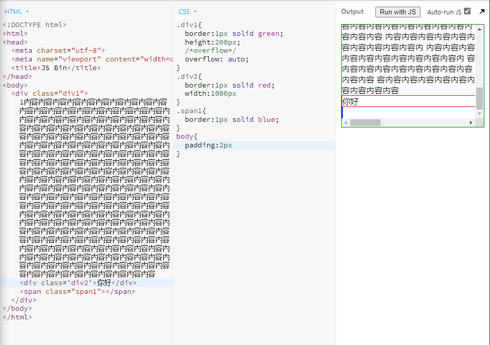

# CSS笔记01

# 文档流
### 流动方向
* inline元素从左到右，到达最右边才会换行
* block元素从上到下，每一个都另起一行
* inline-block 也是从左到右

### 宽度
* inline宽度为内部inline元素的和，不能用width指定

* block默认自动计算宽度，可用width指定
* inline-block 结合两者特点，可用width

css中永远不要写width:100%(大部分情况)
  
### 高度
* inline高度由行高间接确定，跟height无关

* block高度由内部文档流元素决定，可以设置height
* inline-block 跟block类似，可以设置height

### overflow溢出
* 当内容的宽度或高度大于容器，会溢出
* 可用overflow来设置是否显示滚动条
* auto是灵活设置
* scroll是永久设置
* hidden是直接溢出隐藏
* visible是直接显示溢出部分
* overflow可以分为overflow-x和overflow-y

# 脱离文档流
盒模型分两种
1. (content box)标准盒模型：content box的宽度只包含content
2. (border box)怪异盒模型：border box的宽度包含到border，其中包括content，padding和border的宽度

# 外边距合并
### 父子合并
### 兄弟合并

### 解决合并
#### 父子
* padding /border
* overflow:hidden
* display:flex

#### 兄弟
* inline-block
